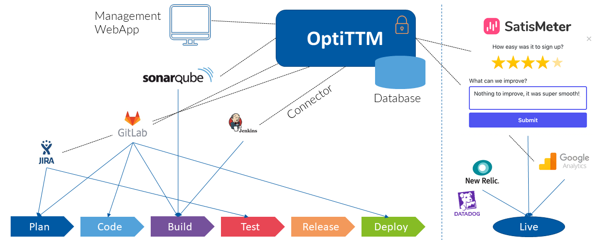

# About

**bugprediction** is a standalone demo of OTTM. OTTM supervises the software development chain (including the live environment) and assesses the risk of coming releases. OTTM is able to build simple, complex, composite, and predictive Key Performance Indicators. OTTM is shipped with connectors to major dev tools (SonarQube, SCMs, Jira, Matomo, Google Analytics, etc.).

See the [list of commands](./commands.md) to start using the tool.
